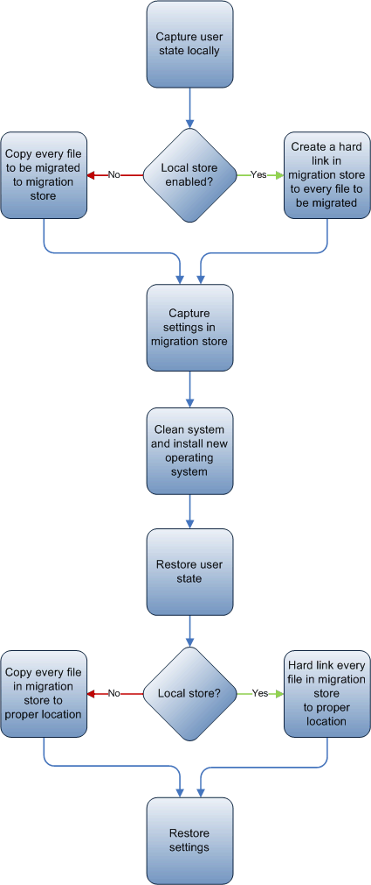

# Migration Store Types Overview

When a migration is being planned, which migration store type best meets the organization's needs should be determined. As part of these considerations, determine how much space is required to run the User State Migration Tool (USMT) components on the source and destination computers. The space needed to create and host the migration store should also be determined, whether using a local share, network share, or storage device.

## Migration store types

This section describes the three migration store types available in USMT.

### Uncompressed (UNC)

The uncompressed (UNC) migration store is an uncompressed directory with a mirror image of the folder hierarchy being migrated. Each directory and file retains the same access permissions that it has on the local file system. Windows Explorer can be used to view this migration store type. Settings are stored in a catalog file that also describes how to restore files on the destination computer.

### Compressed

The compressed migration store is a single image file that contains all files being migrated and a catalog file. This image file is often encrypted and protected with a password, and can't be navigated with Windows Explorer.

### Hard-Link

A hard-link migration store functions as a map that defines how a collection of bits on the hard disk are "wired" into the file system. The USMT hard-link migration store is only used in the PC Refresh scenario. Hard-link migration stores are only used in Refresh scenarios because the hard-link migration store is maintained on the local computer. The hard-link store is maintained on the computer while the old operating system is removed and the new operating system is installed. Using a hard-link migration store saves network bandwidth and minimizes the server use needed to accomplish the migration.

The command-line option `/hardlink` is used to create a hard-link migration store, which functions the same as an uncompressed migration store. Files aren't duplicated on the local computer when user state is captured. They also aren't duplicated when user state is restored. For more information, see [Hard-Link Migration Store](usmt-hard-link-migration-store.md).

The following flowchart illustrates the procedural differences between a local migration store and a remote migration store. In this example, a hard-link migration store is used for the local store.

## Local store vs. remote store

If there's enough space and the user state is being migrated back to the same computer, storing data on a local device is normally the best option to reduce server storage costs and network performance issues. The data can also be stored locally either on a different partition or on a removable device such as a USB flash drive (UFD). Also, the data might be able to be stored on the partition that is being re-imaged if the data can be protected from deletion during the imaging process. One example of an imaging technology that is capable of storing the data on the partition that is being reimaged is Microsoft Configuration Manager. To increase performance, store the data on high-speed drives that use a high-speed network connection. It's also good practice to ensure that the migration is the only task the server is performing.

If there isn't enough local disk space, or if moving the user state to another computer, then the data must be stored remotely such as in one of the following destinations:

- Shared folder.
- Removable media.
- Directly on the destination computer.

For example:

1. Create and share `C:\store` on the destination computer.

1. Run the `ScanState.exe` command on the source computer and save the files and settings to `\\<DestinationComputerName>\store`.

1. Run the `LoadState.exe` command on the destination computer and specify `C:\Store` as the store location.

By doing this process, files don't need to be stored to a server.

> [!IMPORTANT]
>
> If possible, have users store their data within their `%UserProfile%\Documents` and `%UserProfile%\Application Data` folders. Having users store their data at these locations reduces the chance of USMT missing critical user data that is located in a directory that USMT isn't configured to check.

### The /localonly command-line option

This option should be used to exclude the data from removable drives and network drives mapped on the source computer. For more information about what is excluded when `/LocalOnly` is specified, see [ScanState Syntax](usmt-scanstate-syntax.md).

## Related articles

- [Plan the migration](usmt-plan-your-migration.md).
