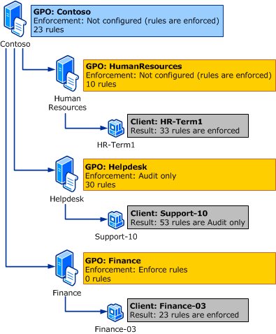

# Understand AppLocker rules and enforcement setting inheritance in Group Policy

This article for the IT professional describes how application control policies configured in AppLocker are applied through Group Policy.

Rule enforcement is applied only to collections of rules, not individual rules. For more info on rule collections, see [AppLocker rule collections](working-with-applocker-rules.md#rule-collections).

Group Policy merges AppLocker policy in two ways:

- **Rules.** Group Policy doesn't overwrite or replace rules that are already present in a linked Group Policy Object (GPO). For example, if the current GPO has 12 rules and a linked GPO has 50 rules, then 62 rules are applied.

    > [!IMPORTANT]
    > When determining whether a file is permitted to run, AppLocker processes rules in the following order:

    1. **Explicit deny.** An administrator created a rule to deny a file.
    2. **Explicit allow.** An administrator created a rule to allow a file.
    3. **Implicit deny.** All files not covered by an allow rule are blocked.

- **Enforcement settings.** The last write to the policy is applied. For example, if a higher-level GPO has the enforcement setting configured to **Enforce rules** and the closest GPO has the setting configured to **Audit only**, **Audit only** is enforced. If enforcement mode isn't configured on the closest GPO, the setting from the closest linked GPO is enforced. Because a computer's effective policy includes rules from each linked GPO, duplicate rules or conflicting rules could be enforced on a user's computer. Therefore, you should carefully plan your deployment to ensure that only rules that are necessary are present in a GPO.

The following figure demonstrates how AppLocker rule enforcement is applied through linked GPOs.

In the preceding illustration, all GPOs linked to Contoso are applied in order as configured. The rules that aren't configured are also applied. For example, the result of the Contoso and Human Resources GPOs is 33 rules enforced, as shown in the client HR-Term1. The Human Resources GPO contains 10 rules where the enforcement mode setting is "not configured." When the rule collection is configured for **Audit only**, no rules are enforced.

When constructing the Group Policy architecture for applying AppLocker policies, it's important to remember:

- Any rule collection with the enforcement mode set as "not configured" is enforced.
- Group Policy doesn't overwrite or replace rules that are already present in a linked GPO.
- AppLocker deny rules always take precedence over any allow rules.
- For rule enforcement, the last write to the GPO is applied.
