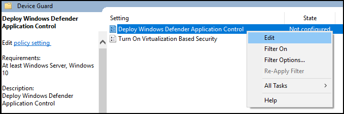

# Deploy App Control for Business policies by using Group Policy

[!INCLUDE [Feature availability note](../includes/feature-availability-note.md)]

> [!IMPORTANT]
> Due to a known issue, you should always activate new **signed** App Control Base policies *with a reboot* on systems with [**memory integrity**](../../../../hardware-security/enable-virtualization-based-protection-of-code-integrity.md) enabled. Instead of Group Policy, deploy new signed App Control Base policies [via script](deploy-appcontrol-policies-with-script.md#deploying-signed-policies) and activate the policy with a system restart.
>
> This issue does not affect updates to signed Base policies that are already active on the system, deployment of unsigned policies, or deployment of supplemental policies (signed or unsigned). It also does not affect deployments to systems that are not running memory integrity.

Single-policy format App Control for Business policies (pre-1903 policy schema) can be easily deployed and managed with Group Policy.

> [!IMPORTANT]
> Group Policy-based deployment of App Control for Business policies only supports single-policy format App Control policies. To use App Control on devices running Windows 10 1903 and greater, or Windows 11, we recommend using an alternative method for policy deployment.

You should now have an App Control policy converted into binary form. If not, follow the steps described in [Deploying App Control for Business policies](appcontrol-deployment-guide.md).

The following procedure walks you through how to deploy an App Control policy called **SiPolicy.p7b** to a test OU called *App Control Enabled PCs* by using a GPO called **Contoso GPO Test**.

To deploy and manage an App Control for Business policy with Group Policy:

1. On a client computer on which RSAT is installed, open the GPMC by running **GPMC.MSC**

2. Create a new GPO: right-click an OU and then select **Create a GPO in this domain, and Link it here**.

   > [!NOTE]
   > You can use any OU name. Also, security group filtering is an option when you consider different ways of combining App Control policies (or keeping them separate), as discussed in [Plan for App Control for Business lifecycle policy management](../design/plan-appcontrol-management.md).

   :::image type="content" alt-text="Group Policy Management, create a GPO." source="../images/dg-fig24-creategpo.png":::

3. Name the new GPO. You can choose any name.

4. Open the Group Policy Management Editor: right-click the new GPO, and then select **Edit**.

5. In the selected GPO, navigate to Computer Configuration\\Administrative Templates\\System\\Device Guard. Right-click **Deploy App Control for Business** and then select **Edit**.

    

6. In the **Deploy App Control for Business** dialog box, select the **Enabled** option, and then specify the App Control policy deployment path.

    In this policy setting, you specify either the local path where the policy will exist on each client computer or a Universal Naming Convention (UNC) path that the client computers will look to retrieve the latest version of the policy. For example, the path to SiPolicy.p7b using the steps described in [Deploying App Control for Business policies](appcontrol-deployment-guide.md) would be %USERPROFILE%\Desktop\SiPolicy.p7b.

    > [!NOTE]
    > This policy file does not need to be copied to every computer. You can instead copy the App Control policies to a file share to which all computer accounts have access. Any policy selected here is converted to SIPolicy.p7b when it is deployed to the individual client computers.

    :::image type="content" alt-text="Group Policy called Deploy App Control for Business." source="../images/dg-fig26-enablecode.png":::

    > [!NOTE]
    > You may have noticed that the GPO setting references a .p7b file, but the file extension and name of the policy binary do not matter. Regardless of what you name your policy binary, they are all converted to SIPolicy.p7b when applied to the client computers running Windows 10. If you are deploying different App Control policies to different sets of devices, you may want to give each of your App Control policies a friendly name and allow the system to convert the policy names for you to ensure that the policies are easily distinguishable when viewed in a share or any other central repository.

7. Close the Group Policy Management Editor, and then restart the Windows test computer. Restarting the computer updates the App Control policy.
