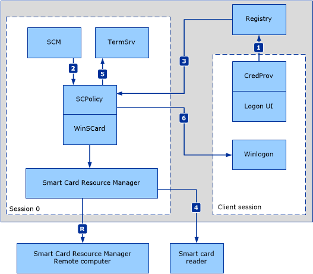

# Smart Card Removal Policy Service

This article describes the role of the removal policy service (`ScPolicySvc`) in smart card implementations.

The smart card removal policy service is applicable when a user signs in with a smart card and then removes that smart card from the reader. The action that is performed when the smart card is removed is controlled by group policy settings. For more information, see [Smart Card Group Policy and Registry Settings](smart-card-group-policy-and-registry-settings.md).

The numbers in the diagram represent the following actions:

1. `Winlogon` isn't directly involved in monitoring for smart card removal events. The sequence of steps that are involved when a smart card is removed begins with the smart card credential provider in the sign-in UI process. When a user successfully signs in with a smart card, the smart card credential provider captures the reader name. This information is then stored in the registry with the session identifier where the sign-in was initiated
1. The smart card resource manager service notifies the smart card removal policy service that a sign-in occurred
1. `ScPolicySvc` retrieves the smart card information that the smart card credential provider stored in the registry. This call is redirected if the user is in a remote session. If the smart card is removed, `ScPolicySvc` is notified
1. `ScPolicySvc` calls Remote Desktop Services to take the appropriate action if the request is to sign out the user or to disconnect the user's session, which might result in data loss. If the setting is configured to lock the computer when the smart card is removed, `ScPolicySvc` sends a message to Winlogon to lock the computer.

## See also

[How Smart Card Sign-in Works in Windows](smart-card-how-smart-card-sign-in-works-in-windows.md)
